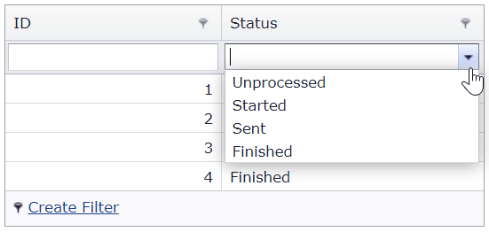

# Grid View for ASP.NET MVC - How to bind a combo box column to Enum
<!-- run online -->
**[[Run Online]](https://codecentral.devexpress.com/147419099/)**
<!-- run online end -->

This example demonstrates how to use the `Enum.GetNames` method to bind a combo box column to **Enum**.



## Overview

Create a combo box column and call the [Enum.GetNames](https://docs.microsoft.com/en-us/dotnet/api/system.enum.getnames?view=netframework-4.7.2) method to generate combo box items based on custom Enum items.

```csharp
settings.Columns.Add(m => m.Status, column => {
    column.ColumnType = MVCxGridViewColumnType.ComboBox;
    var comboBoxProperties = (ComboBoxProperties)column.PropertiesEdit;
    comboBoxProperties.DataSource = Enum.GetNames(typeof(ComboBoxColumnBoundToEnum.Models.OrderHelper.OrderStatus));
});
```

## Files to Review

* [_GridViewPartial.cshtml](./CS/ComboBoxColumnBoundToEnum/Views/Home/_GridViewPartial.cshtml) (VB: [_GridViewPartial.vbhtml](./VB/ComboColumnBoundToEnum/Views/Home/_GridViewPartial.vbhtml))
* [Order.cs](./CS/ComboBoxColumnBoundToEnum/Models/Order.cs) (VB: [Order.vb](./VB/ComboColumnBoundToEnum/Models/Order.vb))
